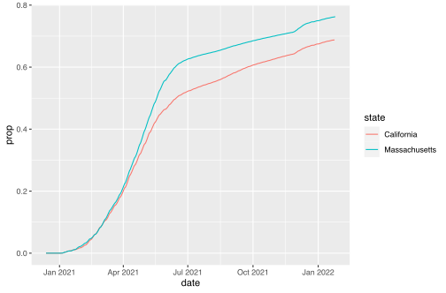
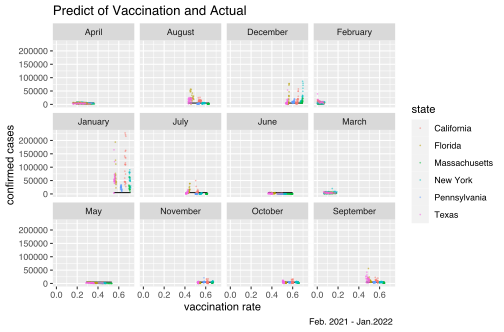

MA \[46\]15 - Data Science in R
================
Daniel Sussman
2022-02-18

First I’ll load in the packages and the data.

``` r
suppressPackageStartupMessages(library(tidyverse))
suppressPackageStartupMessages(library(gt))
suppressPackageStartupMessages(library(lubridate))
load("../../lectures/data/covid19datahub/covid_updated_all_states.RData") 
load("../../lectures/data/covid19datahub/covid_updated_big6.RData") 
```

# Lines and points

## Submission 1

``` r
df_1 <- covid %>% 
  filter(!(is.na(confirmed)|is.na(tests)|is.na(vaccines)))

s <- mean(df_1$confirmed/df_1$tests)

covid_6 %>% 
  filter(!(is.na(confirmed)|is.na(tests)|is.na(vaccines))) %>% 
  group_by(state) %>% 
  ggplot() + 
  geom_point(aes(
      tests, 
      confirmed, 
      color = (people_vaccinated/population)
    ), size=1.5) + 
  facet_wrap(~state) +
  scale_color_viridis_c() +
  theme(axis.text.x = element_text(angle=30)) +
  labs(
    x = 'Number of Tests', 
    y = 'Confirmed Cases', 
    title = "Confirmed Cases vs Number of Tests", 
    caption = 'Diagonal line shows average test positivity rate for all states',
    color = "Vaccination Rate"
  ) +
  geom_abline(slope = s, intercept = 0)
```


This is a plot of confirmed cases vs tests for the 6 states in the big 6
covid data. The color of the lines represents the vaccination rate for
that state, and the black diagonal lines represent the average test
positivity rate for the entire country.

I wanted to be able to write this as one chunk of code without creating
a dummy data frame, but I couldn’t figure out a way to do that.

## Submission 4

``` r
daily %>%
  group_by(state) %>%
  filter(people_vaccinated/population > (0.0001)) %>%
  summarize(
    m = mean(people_vaccinated/population, na.rm = TRUE),
    d = mean(deaths/population, na.rm = TRUE)
  ) %>%
  arrange(desc(m)) %>%
  ggplot(aes(x = m, y = d, color = state)) +
    geom_point() +
    labs(
      x = "Mean Vaccination per Day", 
      y = "Mean Deaths/Population per Day"
    )
```


Plots the Mean Deaths/Population per Day over Mean
Vaccination/Population per Day colored by each State.

Filter the data after a certain date.

I don’t have any lingering questions as of now.

## Submission 7

``` r
covid_6 %>%
  filter(state %in% c("Florida", "California", "Massachusetts", "Texas")) %>%
  select(state, date, deaths) %>%
  group_by(deaths) %>%
  ggplot(aes(x = date, y = deaths, color = state)) +
  geom_point()
```


Number of deaths versus date in four specific states from the covid\_6
data

I was not able to inly show the four states on the plot. All six are
displayed even though I specify which states to use in the filter
command.

## Submission 10

``` r
masscali <- covid_6 %>%
  filter(state %in% c("Massachusetts", "California")) %>%
  filter(!is.na(confirmed))
ggplot(masscali, aes(x=date, y=deaths/confirmed, color=state)) +
  geom_smooth()
```

    `geom_smooth()` using method = 'loess' and formula 'y ~ x'


The plot shows the trend of the ratio of the number of death cases by
the number of total confirmed cases over time for 2 states,
Massachusetts and California. From the plot we can see that
Massachusetts has a very high ratio between 2020-08 and 2020-09, and the
ratio of Massachusetts is generally higher than California since
2020-04.

Kinda want to show the contrast between raw stats and the ratio to show
the difference between raw data graph and the ratio graph.

## Submission 12

``` r
daily %>%
  mutate(vaxxed = replace_na(people_vaccinated, 0)) %>%
  #filter out weird negative values
  filter(
    !is.na(confirmed), 
    !is.na(stringency_index), 
    confirmed > 0, 
    population > 0, 
    people_vaccinated > 0,
    between(stringency_index, 20, 70)
  ) %>%
  group_by(state) %>%
  arrange(date) %>%
  mutate(
    fully_vaxxed = cumsum(vaxxed),
    perc_vaccinated = fully_vaxxed / population, 
    perc_covid = confirmed / population
  ) %>%
  ungroup() %>%
  ggplot() +
  geom_point(aes(x = date, y = perc_covid * 100, color = perc_vaccinated)) +
  labs(
    title = "Daily Percentage of Population with Covid by State Stringency Index",
    y = "Daily % of Population With Covid", 
    x = "Date", 
    color = "% Vaccinated", 
    caption = "Stringency index: the overall strictness of policy measures that primarily restrict people’s behaviour.") +
    scale_x_date(breaks = "5 months", date_labels = "%b %Y") +
    scale_color_viridis_c() +
    facet_wrap(~cut_width(stringency_index, width = 10))
```


subset of data after vaccines were available show % daily population
with covid and overall % vaccinated population within stringency index
groups

## Submission 13

``` r
after_vax <- covid %>% 
  filter(!is.na(vaccines)) %>% 
  mutate(death_rate = deaths/confirmed, death_pc = death_rate/population)

ggplot(after_vax, aes(date, log(death_rate), color = stringency_index)) + #<-- moved aes here
  geom_point(alpha=.03) +
  geom_smooth(color = "red", SE = FALSE) +
  theme(axis.text.x=element_text(angle=30)) +
  labs(title='Death Rate over Time after Vaccines Available', x='date', y='log(death rate)')
```

    Warning: Ignoring unknown parameters: SE

    `geom_smooth()` using method = 'gam' and formula 'y ~ s(x, bs = "cs")'


This plot shows the death rate over time after vaccines became available
to the public. The points are colored by stringency\_index. As
illustrated by the plot, there was a wider variability of death rates in
the early days of the vaccine. As more time goes on, death rates start
to stabilize and began a downward trend in January. We can also see
stringency by color. Stringency was higher when death rates were higher.
There are some outliers with lower death rates, that likely correspond
to specific states.

I would like to be able to explore the qualities of the states with the
outlying death rates. Not sure how to compare them to the states with
higher death rates.

## Submission 18

``` r
d<- daily %>%
  select(date,state,confirmed,deaths,vaccines) %>%
  filter(
    date>='2021-01-01'
    ,state%in%c('California','Texas', 'New York','PennsylVania','Massachusetts')
  ) %>%
  group_by(date,state) %>%
  summarise(confirmed, vaccines, sum(deaths)/sum(confirmed)*100)
dd <- rename(d, death_rate = `sum(deaths)/sum(confirmed) * 100`)
ggplot(dd,aes(x=date,y=death_rate)) +
  geom_point(aes(color=vaccines),alpha=0.7) +
  geom_smooth(size=1.2) +
  ylim(0,10) +
  labs(y='death rate', title='Covid-19 death rate since 2020',color='people vaccinated') +
  facet_wrap(~as.factor(state))
```

    `geom_smooth()` using method = 'loess' and formula 'y ~ x'

    Warning: Removed 98 rows containing non-finite values (stat_smooth).

    Warning: Removed 96 rows containing missing values (geom_point).

    Warning: Removed 1 rows containing missing values (geom_smooth).


The plot shows Covid death rate in four different states, colored by
people vaccinated

When drawing ggplot, I wasn’t able to change the scale of the third
variable (color/alpha/size).

I would like to learn more about how to select the most effective plot
in different occasions

## Submission 19

``` r
covid_6 %>%
  filter(!is.na(people_fully_vaccinated)) %>%
  filter(state == "Massachusetts"|state == "California") %>%
  mutate(prop = people_fully_vaccinated/population) %>%
  ggplot() + 
  geom_line(mapping = aes(x = date, y = prop,color=state))
```


I made a plot based on the proportion of people that are fully
vaccinated in Massachusetts and California in different times. From the
plot we can see that in January 2021, covid-19 vaccines started to enter
the market. From January 2021 to July 2021, there is a rapid growth in
the amount of people who got fully vaccinated in both states. Yet, till
January 2022, the proportion of people who are fully vaccinated reach
78% in Massachusetts while that number is only 68% in California.

## Submission 21

``` r
covid_6 %>%
  arrange(covid_6, state, date) %>%
  filter(!is.na(deaths)) %>%
  select(state, date, deaths) %>%
  ggplot(aes(x = state, y = deaths)) + geom_boxplot()
```


``` r
covid_6 %>%
  arrange(covid_6, state, date) %>%
  filter(!is.na(deaths), !is.na(confirmed)) %>%
  select(state, date, confirmed, deaths) %>%
  mutate(death_rates = deaths/confirmed) %>% filter(death_rates <= 0.09) %>%
  ggplot(aes(date, death_rates)) + geom_point(alpha = 0.1) +
  geom_smooth() +
  facet_wrap(~ as.factor(state)) +
  theme(axis.text.x = element_text(angle = 40))
```

    `geom_smooth()` using method = 'loess' and formula 'y ~ x'


the first code creates a box plot showcasing the covid deaths in each
state after filtering out the missing values.

the second code rearrange the covid 6 data by state and date, then
filtering out missing values, keep only state, date, confirmed, and
deaths column’s. It then creates a new column for death rate. Finally,
ggplot plot the graph with death\_rate &lt;= 0.09 with smoothers.

## Submission 22

``` r
need<- daily_6 %>%
  filter(
    !is.na(vaccines),
    confirmed > 0,
    people_fully_vaccinated > 0,
    date>as.Date("2021-01-31")
  )
new <- need %>% mutate(vac_rate =cumsum(people_fully_vaccinated)/population)
k <- new %>% filter(date<as.Date("2021-12-15"))
library(modelr)
mode <-lm(confirmed ~vac_rate, k)
new %>% add_predictions(mode) %>% #<-- Moved outside ggplot
  ggplot(aes(x= vac_rate)) +
  geom_line(aes(y = pred), alpha = 0.9)+
  geom_point(aes(y = confirmed, color = state), size = 0.2, alpha = 0.4) +
  facet_wrap(~months.Date(date)) +
  labs( 
    x = "vaccination rate ",         
    y = "confirmed cases ",        
    title = "Predict of Vaccination and Actual" ,        
    caption = "Feb. 2021 - Jan.2022 "
  )
```


The plot compares the difference between the actual Covid-19 cases after
vaccination started and the predicted covid-19 cases influenced by
vaccine(based on the data before Omicron).

I want to put the date on the x-axis but the lm seems to be meaningless
if x = date.

## Submission 23

``` r
daily %>% filter(state == 'California') %>% #<-- moved outside ggplot
  ggplot(aes(x = date, y =  confirmed)) +
  geom_bar(stat = "identity", fill = 'steelblue')
```


From the figure, we could see that during 2021, on January, there was an
apparent fluctuation. And in January in 2022, reached a new peak value.

I want to use “group\_by” to group some data and analyze what the covid
is like now. However, I don’t know how to use the correct command to do
this thing.

What’s the relationship with “gglpot” and “geom\_point()” ?

## Submission 25

``` r
df<- daily %>%
  mutate(month = month(date))%>%
  mutate(year = year(date))%>%
  filter(year==2021)%>%
  group_by(state,month,year)%>%
  summarize(
    tpp = log(sum(tests,na.rm=TRUE)/mean(population)),
    pd = sum(deaths,na.rm=TRUE)/mean(population)
  )
  
ggplot(df)+
  geom_point(aes(x=tpp,y=pd,colour=factor(month)))+
  geom_smooth(aes(x=tpp,y=pd),method="loess",colour="black")+
  ylab("Percent Deceased")+
  xlab("log(Tests per person)")+
  labs(colour="Month",title = "Deaths vs. Tests per Person (2021)")
```

    `geom_smooth()` using formula 'y ~ x'


A scatterplot and smoothing curve examining the relationship between the
(log of the) number of tests administered per person and the fatality
rate in 2021. Using only data from 2021 as is the only full year of the
pandemic with the most accurate tests being used by most practitioners.
From the plot, we see that tpp maintain a mostly flat, though slightly
increasing relationship with percent deceased. At around 0.05 tests per
person (log = -3) there is a rise in the fatality rate, peaking around
0.14 tests per person (log=-2) before a slight dip at higher testing
rates and small rise in deaths at the highest points. We also see,
through the monthly coding, a clear trend where spring months see the
least fatalities on average, while winter months see the most.

I’d like to have better broken down the date, either by state or by
month, but there simply weren’t enough observations to make this
feasible. As we can see there’s huge variation in deaths, particularly
in winter months (and august) around log=-2 that could vary well be
better explained by a monthly model as spring months appear to tamper
down the y estimates in that testing range.

None particularly

## Submission 26

``` r
covid_6 %>%
  group_by(state, date) %>%
  summarize(avg_econ_support_index = mean(economic_support_index, na.rm = TRUE)) %>%
  ggplot(aes(x= date, y= avg_econ_support_index, color=state))  +
  geom_smooth()
```

    `geom_smooth()` using method = 'loess' and formula 'y ~ x'

    Warning: Removed 38 rows containing non-finite values (stat_smooth).


Shows a brief timeline of average economic support index of 6 big states
throughout the pandemic

I would have liked to incorporate the number of confirmed cases in each
state somehow

## Submission 27

``` r
ggplot(data = daily, mapping = aes(x = date, y = confirmed)) + geom_point()
```

    Warning: Removed 182 rows containing missing values (geom_point).


Getting the daily covid cases, and see the trend in which the number of
cases increases in terms of points.

I wanted to use more of the code that I learned in the homework but it
was quite hard visualizing without a strict rule.

## Submission 29

``` r
plot <- ggplot(data=covid, aes(x=date, y=tests, group = state, colour = state)) +
  geom_line() +
  labs(y= "Test", x = "Day")
plot + 
  ggtitle("Daily Test") +
  geom_point(alpha = 0.3) +
  geom_smooth(se=FALSE)
```

    `geom_smooth()` using method = 'loess' and formula 'y ~ x'

    Warning: Removed 307 rows containing non-finite values (stat_smooth).

    Warning: Removed 305 row(s) containing missing values (geom_path).

    Warning: Removed 307 rows containing missing values (geom_point).


The plot measure the relationship between daily case numbers and the
date of the year. It’s grouped by state.

## Submission 30

``` r
covid_6 %>%
  group_by(state,date) %>%
  summarise(confirm_rate = confirmed/population) %>%
  ggplot(aes(x=date,y=confirm_rate),color=state) +
  geom_point()
```

    Warning: Removed 4 rows containing missing values (geom_point).


This plot gives the confirmrate of each state day by day

I’m confused that I have written the color=state but it only gives the
black.

# Boxes and bars

## Submission 6

``` r
of_interest<-c("Maryland","Virginia")
covid %>%
  group_by(state) %>%
  filter(state %in% of_interest) %>%
  summarize(max_confirmed=max(confirmed,na.rm=T)) %>%
  ggplot(aes(x=state,y=max_confirmed,fill=state)) +
  geom_col(show.legend=F)
```


creates a set of states used to filter, and then creates a column graph
displaying the maximum recorded confirmed cases on a single date the
state experienced over the course of the pandemic. The code also colors
each column by state.

filter by of interest states without the use of a seperate list

``` r
filter(covid_6, state == "Florida" | "California" | "Massachusetts" | "Texas") %>%
  select(date, deaths) %>%
  group_by(deaths) %>%
  ggplot(data = covid_6) +
  geom_point(mapping = aes(x = date, y = deaths, color = state))
```

## Submission 11

``` r
cleaned_covid <- covid %>% drop_na()
deaths_by_state <- cleaned_covid %>%
  group_by(state) %>% summarize(total_deaths=sum(deaths))
ggplot(deaths_by_state) +
  geom_bar(aes(x=state, y=total_deaths, color=state), stat='identity') +
  coord_flip()
```


Plot looks at each state on the y axis and total deaths on the x axis.
Was able to do this much simpler after learning about the group by and
summarize methods from dplyr.

I was able to accomplish everything I wanted to.

Don’t have many questions, sometimes a little confused on how to make
use of my groups when using group\_by

## Submission 24

``` r
vaccination<-covid %>% 
    filter(!is.na(people_fully_vaccinated)) %>%
    group_by(people_fully_vaccinated) %>% 
    mutate(prop = log(deaths/(confirmed/population)))
ggplot(vaccination, aes(x = people_fully_vaccinated, y = state, color = prop)) + 
    geom_point() +
    labs(
      x = 'Number of Fully Vaccinated People',
      y = 'States',
      title = 'Rates of Death in Population Post Vaccination',
      color = 'Log\n Proportion\n of Deaths in\n Population\n cases'
    ) +
    theme_bw() +
    scale_color_distiller(palette = "YlOrRd")
```


This plot is misleading in that it appears as if the more people that
are vaccinated, the higher the death rate overall, but if you look
subtly towards the ends of the points, the death rates are slightly
lower (or I can be imagining it).

I don’t know if my eyes are playing tricks on me, but this plot did not
come out the way I originally imagined it to be. I had wanted to show
the changes in death rates per case rate when compared against
vaccination levels, but I guess this should have been plotted over time.
Would a heatmap also be misleading?

## Submission 31

``` r
daily %>%
  group_by(state) %>%
  filter(vaccines > 0, n() > 700) %>%
  mutate(count = n()) %>%
  ggplot(aes(reorder(state, vaccines, FUN = median), log(vaccines))) +
  geom_boxplot(aes(fill = count), outlier.alpha = .1) +
  scale_fill_viridis_c() +
  labs(x = "State ordered by median vaccines", y = "Log of Vaccines")
```


I used daily dataset and filtered out the states with less than 700 data
entries. I used mutate to create a new variable count as the number of
data entries for each state. The plot is log vaccines boxplots for each
state ordered by median of vaccines. According to the plot, California,
Texas, and Illinois have the most vaccines, while Illinois have a low
count of data entries.

## Submission 15

``` r
library(maps)
```


    Attaching package: 'maps'

    The following object is masked from 'package:purrr':

        map

``` r
states_map <- map_data("state")
df <- covid %>%
  separate("date", c("Year", "Month", "Day"), sep = "-") %>%
  filter(Year == "2020", Month == "12", Day == "31")
df$state <- tolower(df$state)

ggplot(df, aes(map_id = state)) + geom_map(aes(fill = confirmed),  map = states_map) +
  expand_limits(x = states_map$long, y = states_map$lat) +
  scale_fill_gradient(low = "white", high = "blue") +
  labs(title = "US Confirmed Cases per State by 2020", x = "longitude", y = "latitude",
       caption = " https://www.bsg.ox.ac.uk/research/research-projects/covid-19-government-response-tracker") +
  coord_fixed(1.3) +
  theme(panel.background = element_blank())
```


The map plot shows how many confirmed cases per state by 2020-12-31.

I wanted to add text indicating each state on the map, but I failed by
using geom\_text(), so I am not sure how to accomplish that.

nope

# Tables

## Submission 2

``` r
covid %>%
  filter(date >= "2021-01-01" & date <= "2022-01-01") %>%
  group_by(state) %>%
  summarize(mean_deaths = mean(deaths, na.rm = TRUE)) %>%
  gt() %>%
  tab_header(title = "Average number of Covid-19 deaths across US states", subtitle = "Jan 1st 2021 to Jan 1st 2022") %>% 
  data_color(mean_deaths, scales::col_quantile("Reds", domain = NULL))
```

<div id="psqjgihbjx" style="overflow-x:auto;overflow-y:auto;width:auto;height:auto;">
<style>html {
  font-family: -apple-system, BlinkMacSystemFont, 'Segoe UI', Roboto, Oxygen, Ubuntu, Cantarell, 'Helvetica Neue', 'Fira Sans', 'Droid Sans', Arial, sans-serif;
}

#psqjgihbjx .gt_table {
  display: table;
  border-collapse: collapse;
  margin-left: auto;
  margin-right: auto;
  color: #333333;
  font-size: 16px;
  font-weight: normal;
  font-style: normal;
  background-color: #FFFFFF;
  width: auto;
  border-top-style: solid;
  border-top-width: 2px;
  border-top-color: #A8A8A8;
  border-right-style: none;
  border-right-width: 2px;
  border-right-color: #D3D3D3;
  border-bottom-style: solid;
  border-bottom-width: 2px;
  border-bottom-color: #A8A8A8;
  border-left-style: none;
  border-left-width: 2px;
  border-left-color: #D3D3D3;
}

#psqjgihbjx .gt_heading {
  background-color: #FFFFFF;
  text-align: center;
  border-bottom-color: #FFFFFF;
  border-left-style: none;
  border-left-width: 1px;
  border-left-color: #D3D3D3;
  border-right-style: none;
  border-right-width: 1px;
  border-right-color: #D3D3D3;
}

#psqjgihbjx .gt_title {
  color: #333333;
  font-size: 125%;
  font-weight: initial;
  padding-top: 4px;
  padding-bottom: 4px;
  padding-left: 5px;
  padding-right: 5px;
  border-bottom-color: #FFFFFF;
  border-bottom-width: 0;
}

#psqjgihbjx .gt_subtitle {
  color: #333333;
  font-size: 85%;
  font-weight: initial;
  padding-top: 0;
  padding-bottom: 6px;
  padding-left: 5px;
  padding-right: 5px;
  border-top-color: #FFFFFF;
  border-top-width: 0;
}

#psqjgihbjx .gt_bottom_border {
  border-bottom-style: solid;
  border-bottom-width: 2px;
  border-bottom-color: #D3D3D3;
}

#psqjgihbjx .gt_col_headings {
  border-top-style: solid;
  border-top-width: 2px;
  border-top-color: #D3D3D3;
  border-bottom-style: solid;
  border-bottom-width: 2px;
  border-bottom-color: #D3D3D3;
  border-left-style: none;
  border-left-width: 1px;
  border-left-color: #D3D3D3;
  border-right-style: none;
  border-right-width: 1px;
  border-right-color: #D3D3D3;
}

#psqjgihbjx .gt_col_heading {
  color: #333333;
  background-color: #FFFFFF;
  font-size: 100%;
  font-weight: normal;
  text-transform: inherit;
  border-left-style: none;
  border-left-width: 1px;
  border-left-color: #D3D3D3;
  border-right-style: none;
  border-right-width: 1px;
  border-right-color: #D3D3D3;
  vertical-align: bottom;
  padding-top: 5px;
  padding-bottom: 6px;
  padding-left: 5px;
  padding-right: 5px;
  overflow-x: hidden;
}

#psqjgihbjx .gt_column_spanner_outer {
  color: #333333;
  background-color: #FFFFFF;
  font-size: 100%;
  font-weight: normal;
  text-transform: inherit;
  padding-top: 0;
  padding-bottom: 0;
  padding-left: 4px;
  padding-right: 4px;
}

#psqjgihbjx .gt_column_spanner_outer:first-child {
  padding-left: 0;
}

#psqjgihbjx .gt_column_spanner_outer:last-child {
  padding-right: 0;
}

#psqjgihbjx .gt_column_spanner {
  border-bottom-style: solid;
  border-bottom-width: 2px;
  border-bottom-color: #D3D3D3;
  vertical-align: bottom;
  padding-top: 5px;
  padding-bottom: 5px;
  overflow-x: hidden;
  display: inline-block;
  width: 100%;
}

#psqjgihbjx .gt_group_heading {
  padding-top: 8px;
  padding-bottom: 8px;
  padding-left: 5px;
  padding-right: 5px;
  color: #333333;
  background-color: #FFFFFF;
  font-size: 100%;
  font-weight: initial;
  text-transform: inherit;
  border-top-style: solid;
  border-top-width: 2px;
  border-top-color: #D3D3D3;
  border-bottom-style: solid;
  border-bottom-width: 2px;
  border-bottom-color: #D3D3D3;
  border-left-style: none;
  border-left-width: 1px;
  border-left-color: #D3D3D3;
  border-right-style: none;
  border-right-width: 1px;
  border-right-color: #D3D3D3;
  vertical-align: middle;
}

#psqjgihbjx .gt_empty_group_heading {
  padding: 0.5px;
  color: #333333;
  background-color: #FFFFFF;
  font-size: 100%;
  font-weight: initial;
  border-top-style: solid;
  border-top-width: 2px;
  border-top-color: #D3D3D3;
  border-bottom-style: solid;
  border-bottom-width: 2px;
  border-bottom-color: #D3D3D3;
  vertical-align: middle;
}

#psqjgihbjx .gt_from_md > :first-child {
  margin-top: 0;
}

#psqjgihbjx .gt_from_md > :last-child {
  margin-bottom: 0;
}

#psqjgihbjx .gt_row {
  padding-top: 8px;
  padding-bottom: 8px;
  padding-left: 5px;
  padding-right: 5px;
  margin: 10px;
  border-top-style: solid;
  border-top-width: 1px;
  border-top-color: #D3D3D3;
  border-left-style: none;
  border-left-width: 1px;
  border-left-color: #D3D3D3;
  border-right-style: none;
  border-right-width: 1px;
  border-right-color: #D3D3D3;
  vertical-align: middle;
  overflow-x: hidden;
}

#psqjgihbjx .gt_stub {
  color: #333333;
  background-color: #FFFFFF;
  font-size: 100%;
  font-weight: initial;
  text-transform: inherit;
  border-right-style: solid;
  border-right-width: 2px;
  border-right-color: #D3D3D3;
  padding-left: 5px;
  padding-right: 5px;
}

#psqjgihbjx .gt_stub_row_group {
  color: #333333;
  background-color: #FFFFFF;
  font-size: 100%;
  font-weight: initial;
  text-transform: inherit;
  border-right-style: solid;
  border-right-width: 2px;
  border-right-color: #D3D3D3;
  padding-left: 5px;
  padding-right: 5px;
  vertical-align: top;
}

#psqjgihbjx .gt_row_group_first td {
  border-top-width: 2px;
}

#psqjgihbjx .gt_summary_row {
  color: #333333;
  background-color: #FFFFFF;
  text-transform: inherit;
  padding-top: 8px;
  padding-bottom: 8px;
  padding-left: 5px;
  padding-right: 5px;
}

#psqjgihbjx .gt_first_summary_row {
  border-top-style: solid;
  border-top-color: #D3D3D3;
}

#psqjgihbjx .gt_first_summary_row.thick {
  border-top-width: 2px;
}

#psqjgihbjx .gt_last_summary_row {
  padding-top: 8px;
  padding-bottom: 8px;
  padding-left: 5px;
  padding-right: 5px;
  border-bottom-style: solid;
  border-bottom-width: 2px;
  border-bottom-color: #D3D3D3;
}

#psqjgihbjx .gt_grand_summary_row {
  color: #333333;
  background-color: #FFFFFF;
  text-transform: inherit;
  padding-top: 8px;
  padding-bottom: 8px;
  padding-left: 5px;
  padding-right: 5px;
}

#psqjgihbjx .gt_first_grand_summary_row {
  padding-top: 8px;
  padding-bottom: 8px;
  padding-left: 5px;
  padding-right: 5px;
  border-top-style: double;
  border-top-width: 6px;
  border-top-color: #D3D3D3;
}

#psqjgihbjx .gt_striped {
  background-color: rgba(128, 128, 128, 0.05);
}

#psqjgihbjx .gt_table_body {
  border-top-style: solid;
  border-top-width: 2px;
  border-top-color: #D3D3D3;
  border-bottom-style: solid;
  border-bottom-width: 2px;
  border-bottom-color: #D3D3D3;
}

#psqjgihbjx .gt_footnotes {
  color: #333333;
  background-color: #FFFFFF;
  border-bottom-style: none;
  border-bottom-width: 2px;
  border-bottom-color: #D3D3D3;
  border-left-style: none;
  border-left-width: 2px;
  border-left-color: #D3D3D3;
  border-right-style: none;
  border-right-width: 2px;
  border-right-color: #D3D3D3;
}

#psqjgihbjx .gt_footnote {
  margin: 0px;
  font-size: 90%;
  padding-left: 4px;
  padding-right: 4px;
  padding-left: 5px;
  padding-right: 5px;
}

#psqjgihbjx .gt_sourcenotes {
  color: #333333;
  background-color: #FFFFFF;
  border-bottom-style: none;
  border-bottom-width: 2px;
  border-bottom-color: #D3D3D3;
  border-left-style: none;
  border-left-width: 2px;
  border-left-color: #D3D3D3;
  border-right-style: none;
  border-right-width: 2px;
  border-right-color: #D3D3D3;
}

#psqjgihbjx .gt_sourcenote {
  font-size: 90%;
  padding-top: 4px;
  padding-bottom: 4px;
  padding-left: 5px;
  padding-right: 5px;
}

#psqjgihbjx .gt_left {
  text-align: left;
}

#psqjgihbjx .gt_center {
  text-align: center;
}

#psqjgihbjx .gt_right {
  text-align: right;
  font-variant-numeric: tabular-nums;
}

#psqjgihbjx .gt_font_normal {
  font-weight: normal;
}

#psqjgihbjx .gt_font_bold {
  font-weight: bold;
}

#psqjgihbjx .gt_font_italic {
  font-style: italic;
}

#psqjgihbjx .gt_super {
  font-size: 65%;
}

#psqjgihbjx .gt_footnote_marks {
  font-style: italic;
  font-weight: normal;
  font-size: 75%;
  vertical-align: 0.4em;
}

#psqjgihbjx .gt_asterisk {
  font-size: 100%;
  vertical-align: 0;
}

#psqjgihbjx .gt_slash_mark {
  font-size: 0.7em;
  line-height: 0.7em;
  vertical-align: 0.15em;
}

#psqjgihbjx .gt_fraction_numerator {
  font-size: 0.6em;
  line-height: 0.6em;
  vertical-align: 0.45em;
}

#psqjgihbjx .gt_fraction_denominator {
  font-size: 0.6em;
  line-height: 0.6em;
  vertical-align: -0.05em;
}
</style>
<table class="gt_table">
  <thead class="gt_header">
    <tr>
      <th colspan="2" class="gt_heading gt_title gt_font_normal" style>Average number of Covid-19 deaths across US states</th>
    </tr>
    <tr>
      <th colspan="2" class="gt_heading gt_subtitle gt_font_normal gt_bottom_border" style>Jan 1st 2021 to Jan 1st 2022</th>
    </tr>
  </thead>
  <thead class="gt_col_headings">
    <tr>
      <th class="gt_col_heading gt_columns_bottom_border gt_left" rowspan="1" colspan="1">state</th>
      <th class="gt_col_heading gt_columns_bottom_border gt_right" rowspan="1" colspan="1">mean_deaths</th>
    </tr>
  </thead>
  <tbody class="gt_table_body">
    <tr><td class="gt_row gt_left">Alabama</td>
<td class="gt_row gt_right" style="background-color: #FB6A4A; color: #000000;">11876.9754</td></tr>
    <tr><td class="gt_row gt_left">Alaska</td>
<td class="gt_row gt_right" style="background-color: #FEE5D9; color: #000000;">448.7404</td></tr>
    <tr><td class="gt_row gt_left">Arizona</td>
<td class="gt_row gt_right" style="background-color: #CB181D; color: #FFFFFF;">18074.1913</td></tr>
    <tr><td class="gt_row gt_left">Arkansas</td>
<td class="gt_row gt_right" style="background-color: #FCAE91; color: #000000;">6494.0984</td></tr>
    <tr><td class="gt_row gt_left">California</td>
<td class="gt_row gt_right" style="background-color: #CB181D; color: #FFFFFF;">61773.5984</td></tr>
    <tr><td class="gt_row gt_left">Colorado</td>
<td class="gt_row gt_right" style="background-color: #FCAE91; color: #000000;">7170.0219</td></tr>
    <tr><td class="gt_row gt_left">Connecticut</td>
<td class="gt_row gt_right" style="background-color: #FB6A4A; color: #000000;">8157.7240</td></tr>
    <tr><td class="gt_row gt_left">Delaware</td>
<td class="gt_row gt_right" style="background-color: #FEE5D9; color: #000000;">1718.8798</td></tr>
    <tr><td class="gt_row gt_left">Florida</td>
<td class="gt_row gt_right" style="background-color: #CB181D; color: #FFFFFF;">42064.8880</td></tr>
    <tr><td class="gt_row gt_left">Georgia</td>
<td class="gt_row gt_right" style="background-color: #CB181D; color: #FFFFFF;">21371.6612</td></tr>
    <tr><td class="gt_row gt_left">Hawaii</td>
<td class="gt_row gt_right" style="background-color: #FEE5D9; color: #000000;">611.1175</td></tr>
    <tr><td class="gt_row gt_left">Idaho</td>
<td class="gt_row gt_right" style="background-color: #FEE5D9; color: #000000;">2477.7186</td></tr>
    <tr><td class="gt_row gt_left">Illinois</td>
<td class="gt_row gt_right" style="background-color: #CB181D; color: #FFFFFF;">25512.4126</td></tr>
    <tr><td class="gt_row gt_left">Indiana</td>
<td class="gt_row gt_right" style="background-color: #CB181D; color: #FFFFFF;">14132.6393</td></tr>
    <tr><td class="gt_row gt_left">Iowa</td>
<td class="gt_row gt_right" style="background-color: #FCAE91; color: #000000;">6135.3497</td></tr>
    <tr><td class="gt_row gt_left">Kansas</td>
<td class="gt_row gt_right" style="background-color: #FCAE91; color: #000000;">5345.1557</td></tr>
    <tr><td class="gt_row gt_left">Kentucky</td>
<td class="gt_row gt_right" style="background-color: #FCAE91; color: #000000;">7395.8689</td></tr>
    <tr><td class="gt_row gt_left">Louisiana</td>
<td class="gt_row gt_right" style="background-color: #FB6A4A; color: #000000;">11561.7596</td></tr>
    <tr><td class="gt_row gt_left">Maine</td>
<td class="gt_row gt_right" style="background-color: #FEE5D9; color: #000000;">902.1612</td></tr>
    <tr><td class="gt_row gt_left">Maryland</td>
<td class="gt_row gt_right" style="background-color: #FB6A4A; color: #000000;">9379.2869</td></tr>
    <tr><td class="gt_row gt_left">Massachusetts</td>
<td class="gt_row gt_right" style="background-color: #CB181D; color: #FFFFFF;">17621.1694</td></tr>
    <tr><td class="gt_row gt_left">Michigan</td>
<td class="gt_row gt_right" style="background-color: #CB181D; color: #FFFFFF;">20462.1503</td></tr>
    <tr><td class="gt_row gt_left">Minnesota</td>
<td class="gt_row gt_right" style="background-color: #FB6A4A; color: #000000;">7737.1694</td></tr>
    <tr><td class="gt_row gt_left">Mississippi</td>
<td class="gt_row gt_right" style="background-color: #FB6A4A; color: #000000;">7963.7787</td></tr>
    <tr><td class="gt_row gt_left">Missouri</td>
<td class="gt_row gt_right" style="background-color: #FB6A4A; color: #000000;">10579.6475</td></tr>
    <tr><td class="gt_row gt_left">Montana</td>
<td class="gt_row gt_right" style="background-color: #FEE5D9; color: #000000;">1790.4044</td></tr>
    <tr><td class="gt_row gt_left">Nebraska</td>
<td class="gt_row gt_right" style="background-color: #FEE5D9; color: #000000;">2543.3115</td></tr>
    <tr><td class="gt_row gt_left">Nevada</td>
<td class="gt_row gt_right" style="background-color: #FCAE91; color: #000000;">6040.5273</td></tr>
    <tr><td class="gt_row gt_left">New Hampshire</td>
<td class="gt_row gt_right" style="background-color: #FEE5D9; color: #000000;">1371.0246</td></tr>
    <tr><td class="gt_row gt_left">New Jersey</td>
<td class="gt_row gt_right" style="background-color: #CB181D; color: #FFFFFF;">25780.0137</td></tr>
    <tr><td class="gt_row gt_left">New Mexico</td>
<td class="gt_row gt_right" style="background-color: #FCAE91; color: #000000;">4337.8880</td></tr>
    <tr><td class="gt_row gt_left">New York</td>
<td class="gt_row gt_right" style="background-color: #CB181D; color: #FFFFFF;">51851.2077</td></tr>
    <tr><td class="gt_row gt_left">North Carolina</td>
<td class="gt_row gt_right" style="background-color: #FB6A4A; color: #000000;">13937.5109</td></tr>
    <tr><td class="gt_row gt_left">North Dakota</td>
<td class="gt_row gt_right" style="background-color: #FEE5D9; color: #000000;">1608.3852</td></tr>
    <tr><td class="gt_row gt_left">Ohio</td>
<td class="gt_row gt_right" style="background-color: #CB181D; color: #FFFFFF;">20100.7459</td></tr>
    <tr><td class="gt_row gt_left">Oklahoma</td>
<td class="gt_row gt_right" style="background-color: #FCAE91; color: #000000;">7345.5027</td></tr>
    <tr><td class="gt_row gt_left">Oregon</td>
<td class="gt_row gt_right" style="background-color: #FCAE91; color: #000000;">3162.0191</td></tr>
    <tr><td class="gt_row gt_left">Pennsylvania</td>
<td class="gt_row gt_right" style="background-color: #CB181D; color: #FFFFFF;">27492.2077</td></tr>
    <tr><td class="gt_row gt_left">Rhode Island</td>
<td class="gt_row gt_right" style="background-color: #FCAE91; color: #000000;">2669.9071</td></tr>
    <tr><td class="gt_row gt_left">South Carolina</td>
<td class="gt_row gt_right" style="background-color: #FB6A4A; color: #000000;">10429.3825</td></tr>
    <tr><td class="gt_row gt_left">South Dakota</td>
<td class="gt_row gt_right" style="background-color: #FEE5D9; color: #000000;">2039.1612</td></tr>
    <tr><td class="gt_row gt_left">Tennessee</td>
<td class="gt_row gt_right" style="background-color: #FB6A4A; color: #000000;">13148.3907</td></tr>
    <tr><td class="gt_row gt_left">Texas</td>
<td class="gt_row gt_right" style="background-color: #CB181D; color: #FFFFFF;">55095.2978</td></tr>
    <tr><td class="gt_row gt_left">Utah</td>
<td class="gt_row gt_right" style="background-color: #FEE5D9; color: #000000;">2500.2459</td></tr>
    <tr><td class="gt_row gt_left">Vermont</td>
<td class="gt_row gt_right" style="background-color: #FEE5D9; color: #000000;">276.8251</td></tr>
    <tr><td class="gt_row gt_left">Virginia</td>
<td class="gt_row gt_right" style="background-color: #FB6A4A; color: #000000;">11183.0164</td></tr>
    <tr><td class="gt_row gt_left">Washington</td>
<td class="gt_row gt_right" style="background-color: #FCAE91; color: #000000;">6475.7514</td></tr>
    <tr><td class="gt_row gt_left">West Virginia</td>
<td class="gt_row gt_right" style="background-color: #FCAE91; color: #000000;">3168.5628</td></tr>
    <tr><td class="gt_row gt_left">Wisconsin</td>
<td class="gt_row gt_right" style="background-color: #FB6A4A; color: #000000;">8153.4699</td></tr>
    <tr><td class="gt_row gt_left">Wyoming</td>
<td class="gt_row gt_right" style="background-color: #FEE5D9; color: #000000;">868.0546</td></tr>
  </tbody>
  
  
</table>
</div>

Table showing the mean number of Covid-19 deaths across US states
between Jan 1st 2021 and Jan 1st 2022

## Submission 3

``` r
mean_death_rate_of_confirmed <- covid %>%
  filter(people_vaccinated>=1) %>%
  mutate(death_rate_of_confirmed = deaths/confirmed) %>%
  select(state, death_rate_of_confirmed) %>%
  group_by(state)%>%
  summarize(mdrc = mean(death_rate_of_confirmed)) 

mean_death_rate_of_confirmed 
```

    # A tibble: 50 × 2
       state          mdrc
       <chr>         <dbl>
     1 Alabama     0.0186 
     2 Alaska      0.00500
     3 Arizona     0.0186 
     4 Arkansas    0.0163 
     5 California  0.0147 
     6 Colorado    0.0124 
     7 Connecticut 0.0239 
     8 Delaware    0.0150 
     9 Florida     0.0156 
    10 Georgia     0.0173 
    # … with 40 more rows

``` r
mean_death_rate_of_confirmed2 <- covid %>%
  filter(!is.na(confirmed),!is.na(deaths)) %>%
  filter(is.na(people_vaccinated)) %>%
  mutate(death_rate_of_confirmed2 = deaths/confirmed) %>%
  select(state, death_rate_of_confirmed2) %>%
  group_by(state)%>%
  summarize(mdrc2 = mean(death_rate_of_confirmed2))


mean_death_rate_of_confirmed2
```

    # A tibble: 50 × 2
       state         mdrc2
       <chr>         <dbl>
     1 Alabama     0.0214 
     2 Alaska      0.00945
     3 Arizona     0.0231 
     4 Arkansas    0.0149 
     5 California  0.0209 
     6 Colorado    0.0345 
     7 Connecticut 0.0705 
     8 Delaware    0.0308 
     9 Florida     0.0263 
    10 Georgia     0.0280 
    # … with 40 more rows

The first table shows the mean death rate of people who are confirmed
for each state after people started to get vaccinated, and the second
table shows before people started to get vaccinated. Overall, the death
rates are lower after people started to get vaccinated for most states.

I wonder if there’s a way to combine the two tables to see the numbers
side by side, and then create a side-by-side bar chart to visualize the
data.

None at the moment.

## Submission 5

``` r
covid_6  %>% group_by(state)  %>%
  summarize(
    count = n(),
    population = mean(population), #<-- ADDED
    median_vaccinations = median(people_fully_vaccinated, na.rm = TRUE),
    median_deaths = median(deaths, na.rm = TRUE),
    proportion_vaccinated = median_vaccinations / population,
    proportion_deaths = median_deaths / population
  ) %>% 
  gt() %>% 
  tab_header(
    title = "Relationship between proportion of Vaccinations vs. proportion of deaths for top 6 states "
  ) %>%
  fmt_percent(
    columns = c(proportion_vaccinated, proportion_deaths),
    decimals = 2
  )
```

<div id="uedoremyyt" style="overflow-x:auto;overflow-y:auto;width:auto;height:auto;">
<style>html {
  font-family: -apple-system, BlinkMacSystemFont, 'Segoe UI', Roboto, Oxygen, Ubuntu, Cantarell, 'Helvetica Neue', 'Fira Sans', 'Droid Sans', Arial, sans-serif;
}

#uedoremyyt .gt_table {
  display: table;
  border-collapse: collapse;
  margin-left: auto;
  margin-right: auto;
  color: #333333;
  font-size: 16px;
  font-weight: normal;
  font-style: normal;
  background-color: #FFFFFF;
  width: auto;
  border-top-style: solid;
  border-top-width: 2px;
  border-top-color: #A8A8A8;
  border-right-style: none;
  border-right-width: 2px;
  border-right-color: #D3D3D3;
  border-bottom-style: solid;
  border-bottom-width: 2px;
  border-bottom-color: #A8A8A8;
  border-left-style: none;
  border-left-width: 2px;
  border-left-color: #D3D3D3;
}

#uedoremyyt .gt_heading {
  background-color: #FFFFFF;
  text-align: center;
  border-bottom-color: #FFFFFF;
  border-left-style: none;
  border-left-width: 1px;
  border-left-color: #D3D3D3;
  border-right-style: none;
  border-right-width: 1px;
  border-right-color: #D3D3D3;
}

#uedoremyyt .gt_title {
  color: #333333;
  font-size: 125%;
  font-weight: initial;
  padding-top: 4px;
  padding-bottom: 4px;
  padding-left: 5px;
  padding-right: 5px;
  border-bottom-color: #FFFFFF;
  border-bottom-width: 0;
}

#uedoremyyt .gt_subtitle {
  color: #333333;
  font-size: 85%;
  font-weight: initial;
  padding-top: 0;
  padding-bottom: 6px;
  padding-left: 5px;
  padding-right: 5px;
  border-top-color: #FFFFFF;
  border-top-width: 0;
}

#uedoremyyt .gt_bottom_border {
  border-bottom-style: solid;
  border-bottom-width: 2px;
  border-bottom-color: #D3D3D3;
}

#uedoremyyt .gt_col_headings {
  border-top-style: solid;
  border-top-width: 2px;
  border-top-color: #D3D3D3;
  border-bottom-style: solid;
  border-bottom-width: 2px;
  border-bottom-color: #D3D3D3;
  border-left-style: none;
  border-left-width: 1px;
  border-left-color: #D3D3D3;
  border-right-style: none;
  border-right-width: 1px;
  border-right-color: #D3D3D3;
}

#uedoremyyt .gt_col_heading {
  color: #333333;
  background-color: #FFFFFF;
  font-size: 100%;
  font-weight: normal;
  text-transform: inherit;
  border-left-style: none;
  border-left-width: 1px;
  border-left-color: #D3D3D3;
  border-right-style: none;
  border-right-width: 1px;
  border-right-color: #D3D3D3;
  vertical-align: bottom;
  padding-top: 5px;
  padding-bottom: 6px;
  padding-left: 5px;
  padding-right: 5px;
  overflow-x: hidden;
}

#uedoremyyt .gt_column_spanner_outer {
  color: #333333;
  background-color: #FFFFFF;
  font-size: 100%;
  font-weight: normal;
  text-transform: inherit;
  padding-top: 0;
  padding-bottom: 0;
  padding-left: 4px;
  padding-right: 4px;
}

#uedoremyyt .gt_column_spanner_outer:first-child {
  padding-left: 0;
}

#uedoremyyt .gt_column_spanner_outer:last-child {
  padding-right: 0;
}

#uedoremyyt .gt_column_spanner {
  border-bottom-style: solid;
  border-bottom-width: 2px;
  border-bottom-color: #D3D3D3;
  vertical-align: bottom;
  padding-top: 5px;
  padding-bottom: 5px;
  overflow-x: hidden;
  display: inline-block;
  width: 100%;
}

#uedoremyyt .gt_group_heading {
  padding-top: 8px;
  padding-bottom: 8px;
  padding-left: 5px;
  padding-right: 5px;
  color: #333333;
  background-color: #FFFFFF;
  font-size: 100%;
  font-weight: initial;
  text-transform: inherit;
  border-top-style: solid;
  border-top-width: 2px;
  border-top-color: #D3D3D3;
  border-bottom-style: solid;
  border-bottom-width: 2px;
  border-bottom-color: #D3D3D3;
  border-left-style: none;
  border-left-width: 1px;
  border-left-color: #D3D3D3;
  border-right-style: none;
  border-right-width: 1px;
  border-right-color: #D3D3D3;
  vertical-align: middle;
}

#uedoremyyt .gt_empty_group_heading {
  padding: 0.5px;
  color: #333333;
  background-color: #FFFFFF;
  font-size: 100%;
  font-weight: initial;
  border-top-style: solid;
  border-top-width: 2px;
  border-top-color: #D3D3D3;
  border-bottom-style: solid;
  border-bottom-width: 2px;
  border-bottom-color: #D3D3D3;
  vertical-align: middle;
}

#uedoremyyt .gt_from_md > :first-child {
  margin-top: 0;
}

#uedoremyyt .gt_from_md > :last-child {
  margin-bottom: 0;
}

#uedoremyyt .gt_row {
  padding-top: 8px;
  padding-bottom: 8px;
  padding-left: 5px;
  padding-right: 5px;
  margin: 10px;
  border-top-style: solid;
  border-top-width: 1px;
  border-top-color: #D3D3D3;
  border-left-style: none;
  border-left-width: 1px;
  border-left-color: #D3D3D3;
  border-right-style: none;
  border-right-width: 1px;
  border-right-color: #D3D3D3;
  vertical-align: middle;
  overflow-x: hidden;
}

#uedoremyyt .gt_stub {
  color: #333333;
  background-color: #FFFFFF;
  font-size: 100%;
  font-weight: initial;
  text-transform: inherit;
  border-right-style: solid;
  border-right-width: 2px;
  border-right-color: #D3D3D3;
  padding-left: 5px;
  padding-right: 5px;
}

#uedoremyyt .gt_stub_row_group {
  color: #333333;
  background-color: #FFFFFF;
  font-size: 100%;
  font-weight: initial;
  text-transform: inherit;
  border-right-style: solid;
  border-right-width: 2px;
  border-right-color: #D3D3D3;
  padding-left: 5px;
  padding-right: 5px;
  vertical-align: top;
}

#uedoremyyt .gt_row_group_first td {
  border-top-width: 2px;
}

#uedoremyyt .gt_summary_row {
  color: #333333;
  background-color: #FFFFFF;
  text-transform: inherit;
  padding-top: 8px;
  padding-bottom: 8px;
  padding-left: 5px;
  padding-right: 5px;
}

#uedoremyyt .gt_first_summary_row {
  border-top-style: solid;
  border-top-color: #D3D3D3;
}

#uedoremyyt .gt_first_summary_row.thick {
  border-top-width: 2px;
}

#uedoremyyt .gt_last_summary_row {
  padding-top: 8px;
  padding-bottom: 8px;
  padding-left: 5px;
  padding-right: 5px;
  border-bottom-style: solid;
  border-bottom-width: 2px;
  border-bottom-color: #D3D3D3;
}

#uedoremyyt .gt_grand_summary_row {
  color: #333333;
  background-color: #FFFFFF;
  text-transform: inherit;
  padding-top: 8px;
  padding-bottom: 8px;
  padding-left: 5px;
  padding-right: 5px;
}

#uedoremyyt .gt_first_grand_summary_row {
  padding-top: 8px;
  padding-bottom: 8px;
  padding-left: 5px;
  padding-right: 5px;
  border-top-style: double;
  border-top-width: 6px;
  border-top-color: #D3D3D3;
}

#uedoremyyt .gt_striped {
  background-color: rgba(128, 128, 128, 0.05);
}

#uedoremyyt .gt_table_body {
  border-top-style: solid;
  border-top-width: 2px;
  border-top-color: #D3D3D3;
  border-bottom-style: solid;
  border-bottom-width: 2px;
  border-bottom-color: #D3D3D3;
}

#uedoremyyt .gt_footnotes {
  color: #333333;
  background-color: #FFFFFF;
  border-bottom-style: none;
  border-bottom-width: 2px;
  border-bottom-color: #D3D3D3;
  border-left-style: none;
  border-left-width: 2px;
  border-left-color: #D3D3D3;
  border-right-style: none;
  border-right-width: 2px;
  border-right-color: #D3D3D3;
}

#uedoremyyt .gt_footnote {
  margin: 0px;
  font-size: 90%;
  padding-left: 4px;
  padding-right: 4px;
  padding-left: 5px;
  padding-right: 5px;
}

#uedoremyyt .gt_sourcenotes {
  color: #333333;
  background-color: #FFFFFF;
  border-bottom-style: none;
  border-bottom-width: 2px;
  border-bottom-color: #D3D3D3;
  border-left-style: none;
  border-left-width: 2px;
  border-left-color: #D3D3D3;
  border-right-style: none;
  border-right-width: 2px;
  border-right-color: #D3D3D3;
}

#uedoremyyt .gt_sourcenote {
  font-size: 90%;
  padding-top: 4px;
  padding-bottom: 4px;
  padding-left: 5px;
  padding-right: 5px;
}

#uedoremyyt .gt_left {
  text-align: left;
}

#uedoremyyt .gt_center {
  text-align: center;
}

#uedoremyyt .gt_right {
  text-align: right;
  font-variant-numeric: tabular-nums;
}

#uedoremyyt .gt_font_normal {
  font-weight: normal;
}

#uedoremyyt .gt_font_bold {
  font-weight: bold;
}

#uedoremyyt .gt_font_italic {
  font-style: italic;
}

#uedoremyyt .gt_super {
  font-size: 65%;
}

#uedoremyyt .gt_footnote_marks {
  font-style: italic;
  font-weight: normal;
  font-size: 75%;
  vertical-align: 0.4em;
}

#uedoremyyt .gt_asterisk {
  font-size: 100%;
  vertical-align: 0;
}

#uedoremyyt .gt_slash_mark {
  font-size: 0.7em;
  line-height: 0.7em;
  vertical-align: 0.15em;
}

#uedoremyyt .gt_fraction_numerator {
  font-size: 0.6em;
  line-height: 0.6em;
  vertical-align: 0.45em;
}

#uedoremyyt .gt_fraction_denominator {
  font-size: 0.6em;
  line-height: 0.6em;
  vertical-align: -0.05em;
}
</style>
<table class="gt_table">
  <thead class="gt_header">
    <tr>
      <th colspan="7" class="gt_heading gt_title gt_font_normal gt_bottom_border" style>Relationship between proportion of Vaccinations vs. proportion of deaths for top 6 states </th>
    </tr>
    
  </thead>
  <thead class="gt_col_headings">
    <tr>
      <th class="gt_col_heading gt_columns_bottom_border gt_left" rowspan="1" colspan="1">state</th>
      <th class="gt_col_heading gt_columns_bottom_border gt_right" rowspan="1" colspan="1">count</th>
      <th class="gt_col_heading gt_columns_bottom_border gt_right" rowspan="1" colspan="1">population</th>
      <th class="gt_col_heading gt_columns_bottom_border gt_right" rowspan="1" colspan="1">median_vaccinations</th>
      <th class="gt_col_heading gt_columns_bottom_border gt_right" rowspan="1" colspan="1">median_deaths</th>
      <th class="gt_col_heading gt_columns_bottom_border gt_right" rowspan="1" colspan="1">proportion_vaccinated</th>
      <th class="gt_col_heading gt_columns_bottom_border gt_right" rowspan="1" colspan="1">proportion_deaths</th>
    </tr>
  </thead>
  <tbody class="gt_table_body">
    <tr><td class="gt_row gt_left">California</td>
<td class="gt_row gt_right">731</td>
<td class="gt_row gt_right">39512223</td>
<td class="gt_row gt_right">20721066</td>
<td class="gt_row gt_right">37118.0</td>
<td class="gt_row gt_right">52.44%</td>
<td class="gt_row gt_right">0.09%</td></tr>
    <tr><td class="gt_row gt_left">Florida</td>
<td class="gt_row gt_right">696</td>
<td class="gt_row gt_right">21477737</td>
<td class="gt_row gt_right">10293542</td>
<td class="gt_row gt_right">28472.5</td>
<td class="gt_row gt_right">47.93%</td>
<td class="gt_row gt_right">0.13%</td></tr>
    <tr><td class="gt_row gt_left">Massachusetts</td>
<td class="gt_row gt_right">725</td>
<td class="gt_row gt_right">6892503</td>
<td class="gt_row gt_right">4331339</td>
<td class="gt_row gt_right">14348.0</td>
<td class="gt_row gt_right">62.84%</td>
<td class="gt_row gt_right">0.21%</td></tr>
    <tr><td class="gt_row gt_left">New York</td>
<td class="gt_row gt_right">691</td>
<td class="gt_row gt_right">19453561</td>
<td class="gt_row gt_right">10919114</td>
<td class="gt_row gt_right">44683.0</td>
<td class="gt_row gt_right">56.13%</td>
<td class="gt_row gt_right">0.23%</td></tr>
    <tr><td class="gt_row gt_left">Pennsylvania</td>
<td class="gt_row gt_right">695</td>
<td class="gt_row gt_right">12801989</td>
<td class="gt_row gt_right">6768815</td>
<td class="gt_row gt_right">23136.0</td>
<td class="gt_row gt_right">52.87%</td>
<td class="gt_row gt_right">0.18%</td></tr>
    <tr><td class="gt_row gt_left">Texas</td>
<td class="gt_row gt_right">714</td>
<td class="gt_row gt_right">28995881</td>
<td class="gt_row gt_right">12547025</td>
<td class="gt_row gt_right">37981.5</td>
<td class="gt_row gt_right">43.27%</td>
<td class="gt_row gt_right">0.13%</td></tr>
  </tbody>
  
  
</table>
</div>

I am trying to create a summary table that shows the proportion of
vaccinated vs deaths for each state, to then plot and see if there is a
relationship between the two. (ex/ states with higher proportions of
vaccinations have lower death proportions etc)

I didn’t get around to plotting because I am having some issues with the
table, although I am grouping by state, I get multiple rows of the
calculations per state (same numbers in each one).I was unable to solve
this problem

N/A

## Submission 8

``` r
covid %>% group_by(tests) %>%
  summarize(mean_death = mean(deaths, na.rm = TRUE))
```

    # A tibble: 34,028 × 2
       tests mean_death
       <int>      <dbl>
     1     1      0.367
     2     2      0.571
     3     3      2.75 
     4     4      3.68 
     5     5      0    
     6     6      2.14 
     7     7      0    
     8     8      0    
     9     9      0    
    10    10      0.857
    # … with 34,018 more rows

Similar to last time, I want to more about the relationship between test
cases and deaths. This time, by using the grouby function and summarize
function, I want to figure out how many deaths per cases

I want to graph it but it returns a table.

I think I need to practice how to use the dplyr library more.

## Submission 9

``` r
daily_6 %>%
  group_by(state) %>%
  summarize(pct_dead_if_fullvaxed = mean(!is.na(people_fully_vaccinated)/!is.na(deaths)))
```

    # A tibble: 6 × 2
      state         pct_dead_if_fullvaxed
      <chr>                         <dbl>
    1 California                    0.558
    2 Florida                       0.587
    3 Massachusetts                 0.564
    4 New York                      0.584
    5 Pennsylvania                  0.588
    6 Texas                         0.572

This table has the percent of people who died who were fully vaccinated
by state. We can tell that in all states the percent was approximately
the same somewhere between 55-58% of deaths, people were fully
vaccinated.

No, but I am still a bit confused about the missing values and how it
might have affected my line of code and my table.

## Submission 14

``` r
one_day <- "2020-03-01"

covid %>%
  filter(date == one_day) %>%
  select(date, state, stringency_index, government_response_index, containment_health_index) %>%
  gt() %>%
  tab_header(
    title = "The three indexs of each state on Mar 1 2020",
    subtitle = "2020-03-01"
  ) %>%
  fmt_date(
    columns = date,
    date_style = 2
  )
```

<div id="vsjbycgxqs" style="overflow-x:auto;overflow-y:auto;width:auto;height:auto;">
<style>html {
  font-family: -apple-system, BlinkMacSystemFont, 'Segoe UI', Roboto, Oxygen, Ubuntu, Cantarell, 'Helvetica Neue', 'Fira Sans', 'Droid Sans', Arial, sans-serif;
}

#vsjbycgxqs .gt_table {
  display: table;
  border-collapse: collapse;
  margin-left: auto;
  margin-right: auto;
  color: #333333;
  font-size: 16px;
  font-weight: normal;
  font-style: normal;
  background-color: #FFFFFF;
  width: auto;
  border-top-style: solid;
  border-top-width: 2px;
  border-top-color: #A8A8A8;
  border-right-style: none;
  border-right-width: 2px;
  border-right-color: #D3D3D3;
  border-bottom-style: solid;
  border-bottom-width: 2px;
  border-bottom-color: #A8A8A8;
  border-left-style: none;
  border-left-width: 2px;
  border-left-color: #D3D3D3;
}

#vsjbycgxqs .gt_heading {
  background-color: #FFFFFF;
  text-align: center;
  border-bottom-color: #FFFFFF;
  border-left-style: none;
  border-left-width: 1px;
  border-left-color: #D3D3D3;
  border-right-style: none;
  border-right-width: 1px;
  border-right-color: #D3D3D3;
}

#vsjbycgxqs .gt_title {
  color: #333333;
  font-size: 125%;
  font-weight: initial;
  padding-top: 4px;
  padding-bottom: 4px;
  padding-left: 5px;
  padding-right: 5px;
  border-bottom-color: #FFFFFF;
  border-bottom-width: 0;
}

#vsjbycgxqs .gt_subtitle {
  color: #333333;
  font-size: 85%;
  font-weight: initial;
  padding-top: 0;
  padding-bottom: 6px;
  padding-left: 5px;
  padding-right: 5px;
  border-top-color: #FFFFFF;
  border-top-width: 0;
}

#vsjbycgxqs .gt_bottom_border {
  border-bottom-style: solid;
  border-bottom-width: 2px;
  border-bottom-color: #D3D3D3;
}

#vsjbycgxqs .gt_col_headings {
  border-top-style: solid;
  border-top-width: 2px;
  border-top-color: #D3D3D3;
  border-bottom-style: solid;
  border-bottom-width: 2px;
  border-bottom-color: #D3D3D3;
  border-left-style: none;
  border-left-width: 1px;
  border-left-color: #D3D3D3;
  border-right-style: none;
  border-right-width: 1px;
  border-right-color: #D3D3D3;
}

#vsjbycgxqs .gt_col_heading {
  color: #333333;
  background-color: #FFFFFF;
  font-size: 100%;
  font-weight: normal;
  text-transform: inherit;
  border-left-style: none;
  border-left-width: 1px;
  border-left-color: #D3D3D3;
  border-right-style: none;
  border-right-width: 1px;
  border-right-color: #D3D3D3;
  vertical-align: bottom;
  padding-top: 5px;
  padding-bottom: 6px;
  padding-left: 5px;
  padding-right: 5px;
  overflow-x: hidden;
}

#vsjbycgxqs .gt_column_spanner_outer {
  color: #333333;
  background-color: #FFFFFF;
  font-size: 100%;
  font-weight: normal;
  text-transform: inherit;
  padding-top: 0;
  padding-bottom: 0;
  padding-left: 4px;
  padding-right: 4px;
}

#vsjbycgxqs .gt_column_spanner_outer:first-child {
  padding-left: 0;
}

#vsjbycgxqs .gt_column_spanner_outer:last-child {
  padding-right: 0;
}

#vsjbycgxqs .gt_column_spanner {
  border-bottom-style: solid;
  border-bottom-width: 2px;
  border-bottom-color: #D3D3D3;
  vertical-align: bottom;
  padding-top: 5px;
  padding-bottom: 5px;
  overflow-x: hidden;
  display: inline-block;
  width: 100%;
}

#vsjbycgxqs .gt_group_heading {
  padding-top: 8px;
  padding-bottom: 8px;
  padding-left: 5px;
  padding-right: 5px;
  color: #333333;
  background-color: #FFFFFF;
  font-size: 100%;
  font-weight: initial;
  text-transform: inherit;
  border-top-style: solid;
  border-top-width: 2px;
  border-top-color: #D3D3D3;
  border-bottom-style: solid;
  border-bottom-width: 2px;
  border-bottom-color: #D3D3D3;
  border-left-style: none;
  border-left-width: 1px;
  border-left-color: #D3D3D3;
  border-right-style: none;
  border-right-width: 1px;
  border-right-color: #D3D3D3;
  vertical-align: middle;
}

#vsjbycgxqs .gt_empty_group_heading {
  padding: 0.5px;
  color: #333333;
  background-color: #FFFFFF;
  font-size: 100%;
  font-weight: initial;
  border-top-style: solid;
  border-top-width: 2px;
  border-top-color: #D3D3D3;
  border-bottom-style: solid;
  border-bottom-width: 2px;
  border-bottom-color: #D3D3D3;
  vertical-align: middle;
}

#vsjbycgxqs .gt_from_md > :first-child {
  margin-top: 0;
}

#vsjbycgxqs .gt_from_md > :last-child {
  margin-bottom: 0;
}

#vsjbycgxqs .gt_row {
  padding-top: 8px;
  padding-bottom: 8px;
  padding-left: 5px;
  padding-right: 5px;
  margin: 10px;
  border-top-style: solid;
  border-top-width: 1px;
  border-top-color: #D3D3D3;
  border-left-style: none;
  border-left-width: 1px;
  border-left-color: #D3D3D3;
  border-right-style: none;
  border-right-width: 1px;
  border-right-color: #D3D3D3;
  vertical-align: middle;
  overflow-x: hidden;
}

#vsjbycgxqs .gt_stub {
  color: #333333;
  background-color: #FFFFFF;
  font-size: 100%;
  font-weight: initial;
  text-transform: inherit;
  border-right-style: solid;
  border-right-width: 2px;
  border-right-color: #D3D3D3;
  padding-left: 5px;
  padding-right: 5px;
}

#vsjbycgxqs .gt_stub_row_group {
  color: #333333;
  background-color: #FFFFFF;
  font-size: 100%;
  font-weight: initial;
  text-transform: inherit;
  border-right-style: solid;
  border-right-width: 2px;
  border-right-color: #D3D3D3;
  padding-left: 5px;
  padding-right: 5px;
  vertical-align: top;
}

#vsjbycgxqs .gt_row_group_first td {
  border-top-width: 2px;
}

#vsjbycgxqs .gt_summary_row {
  color: #333333;
  background-color: #FFFFFF;
  text-transform: inherit;
  padding-top: 8px;
  padding-bottom: 8px;
  padding-left: 5px;
  padding-right: 5px;
}

#vsjbycgxqs .gt_first_summary_row {
  border-top-style: solid;
  border-top-color: #D3D3D3;
}

#vsjbycgxqs .gt_first_summary_row.thick {
  border-top-width: 2px;
}

#vsjbycgxqs .gt_last_summary_row {
  padding-top: 8px;
  padding-bottom: 8px;
  padding-left: 5px;
  padding-right: 5px;
  border-bottom-style: solid;
  border-bottom-width: 2px;
  border-bottom-color: #D3D3D3;
}

#vsjbycgxqs .gt_grand_summary_row {
  color: #333333;
  background-color: #FFFFFF;
  text-transform: inherit;
  padding-top: 8px;
  padding-bottom: 8px;
  padding-left: 5px;
  padding-right: 5px;
}

#vsjbycgxqs .gt_first_grand_summary_row {
  padding-top: 8px;
  padding-bottom: 8px;
  padding-left: 5px;
  padding-right: 5px;
  border-top-style: double;
  border-top-width: 6px;
  border-top-color: #D3D3D3;
}

#vsjbycgxqs .gt_striped {
  background-color: rgba(128, 128, 128, 0.05);
}

#vsjbycgxqs .gt_table_body {
  border-top-style: solid;
  border-top-width: 2px;
  border-top-color: #D3D3D3;
  border-bottom-style: solid;
  border-bottom-width: 2px;
  border-bottom-color: #D3D3D3;
}

#vsjbycgxqs .gt_footnotes {
  color: #333333;
  background-color: #FFFFFF;
  border-bottom-style: none;
  border-bottom-width: 2px;
  border-bottom-color: #D3D3D3;
  border-left-style: none;
  border-left-width: 2px;
  border-left-color: #D3D3D3;
  border-right-style: none;
  border-right-width: 2px;
  border-right-color: #D3D3D3;
}

#vsjbycgxqs .gt_footnote {
  margin: 0px;
  font-size: 90%;
  padding-left: 4px;
  padding-right: 4px;
  padding-left: 5px;
  padding-right: 5px;
}

#vsjbycgxqs .gt_sourcenotes {
  color: #333333;
  background-color: #FFFFFF;
  border-bottom-style: none;
  border-bottom-width: 2px;
  border-bottom-color: #D3D3D3;
  border-left-style: none;
  border-left-width: 2px;
  border-left-color: #D3D3D3;
  border-right-style: none;
  border-right-width: 2px;
  border-right-color: #D3D3D3;
}

#vsjbycgxqs .gt_sourcenote {
  font-size: 90%;
  padding-top: 4px;
  padding-bottom: 4px;
  padding-left: 5px;
  padding-right: 5px;
}

#vsjbycgxqs .gt_left {
  text-align: left;
}

#vsjbycgxqs .gt_center {
  text-align: center;
}

#vsjbycgxqs .gt_right {
  text-align: right;
  font-variant-numeric: tabular-nums;
}

#vsjbycgxqs .gt_font_normal {
  font-weight: normal;
}

#vsjbycgxqs .gt_font_bold {
  font-weight: bold;
}

#vsjbycgxqs .gt_font_italic {
  font-style: italic;
}

#vsjbycgxqs .gt_super {
  font-size: 65%;
}

#vsjbycgxqs .gt_footnote_marks {
  font-style: italic;
  font-weight: normal;
  font-size: 75%;
  vertical-align: 0.4em;
}

#vsjbycgxqs .gt_asterisk {
  font-size: 100%;
  vertical-align: 0;
}

#vsjbycgxqs .gt_slash_mark {
  font-size: 0.7em;
  line-height: 0.7em;
  vertical-align: 0.15em;
}

#vsjbycgxqs .gt_fraction_numerator {
  font-size: 0.6em;
  line-height: 0.6em;
  vertical-align: 0.45em;
}

#vsjbycgxqs .gt_fraction_denominator {
  font-size: 0.6em;
  line-height: 0.6em;
  vertical-align: -0.05em;
}
</style>
<table class="gt_table">
  <thead class="gt_header">
    <tr>
      <th colspan="5" class="gt_heading gt_title gt_font_normal" style>The three indexs of each state on Mar 1 2020</th>
    </tr>
    <tr>
      <th colspan="5" class="gt_heading gt_subtitle gt_font_normal gt_bottom_border" style>2020-03-01</th>
    </tr>
  </thead>
  <thead class="gt_col_headings">
    <tr>
      <th class="gt_col_heading gt_columns_bottom_border gt_left" rowspan="1" colspan="1">date</th>
      <th class="gt_col_heading gt_columns_bottom_border gt_left" rowspan="1" colspan="1">state</th>
      <th class="gt_col_heading gt_columns_bottom_border gt_right" rowspan="1" colspan="1">stringency_index</th>
      <th class="gt_col_heading gt_columns_bottom_border gt_right" rowspan="1" colspan="1">government_response_index</th>
      <th class="gt_col_heading gt_columns_bottom_border gt_right" rowspan="1" colspan="1">containment_health_index</th>
    </tr>
  </thead>
  <tbody class="gt_table_body">
    <tr><td class="gt_row gt_left">Sunday, March 1, 2020</td>
<td class="gt_row gt_left">California</td>
<td class="gt_row gt_right">8.33</td>
<td class="gt_row gt_right">9.90</td>
<td class="gt_row gt_right">11.31</td></tr>
    <tr><td class="gt_row gt_left">Sunday, March 1, 2020</td>
<td class="gt_row gt_left">Florida</td>
<td class="gt_row gt_right">11.11</td>
<td class="gt_row gt_right">11.46</td>
<td class="gt_row gt_right">13.10</td></tr>
    <tr><td class="gt_row gt_left">Sunday, March 1, 2020</td>
<td class="gt_row gt_left">Kansas</td>
<td class="gt_row gt_right">0.00</td>
<td class="gt_row gt_right">5.21</td>
<td class="gt_row gt_right">5.95</td></tr>
    <tr><td class="gt_row gt_left">Sunday, March 1, 2020</td>
<td class="gt_row gt_left">Washington</td>
<td class="gt_row gt_right">5.56</td>
<td class="gt_row gt_right">10.42</td>
<td class="gt_row gt_right">11.90</td></tr>
    <tr><td class="gt_row gt_left">Sunday, March 1, 2020</td>
<td class="gt_row gt_left">Oregon</td>
<td class="gt_row gt_right">5.56</td>
<td class="gt_row gt_right">12.50</td>
<td class="gt_row gt_right">14.29</td></tr>
    <tr><td class="gt_row gt_left">Sunday, March 1, 2020</td>
<td class="gt_row gt_left">Wisconsin</td>
<td class="gt_row gt_right">5.56</td>
<td class="gt_row gt_right">8.33</td>
<td class="gt_row gt_right">9.52</td></tr>
    <tr><td class="gt_row gt_left">Sunday, March 1, 2020</td>
<td class="gt_row gt_left">New Jersey</td>
<td class="gt_row gt_right">5.56</td>
<td class="gt_row gt_right">8.33</td>
<td class="gt_row gt_right">9.52</td></tr>
    <tr><td class="gt_row gt_left">Sunday, March 1, 2020</td>
<td class="gt_row gt_left">Rhode Island</td>
<td class="gt_row gt_right">11.11</td>
<td class="gt_row gt_right">11.46</td>
<td class="gt_row gt_right">13.10</td></tr>
    <tr><td class="gt_row gt_left">Sunday, March 1, 2020</td>
<td class="gt_row gt_left">Alabama</td>
<td class="gt_row gt_right">0.00</td>
<td class="gt_row gt_right">5.21</td>
<td class="gt_row gt_right">5.95</td></tr>
    <tr><td class="gt_row gt_left">Sunday, March 1, 2020</td>
<td class="gt_row gt_left">Utah</td>
<td class="gt_row gt_right">5.56</td>
<td class="gt_row gt_right">8.33</td>
<td class="gt_row gt_right">9.52</td></tr>
    <tr><td class="gt_row gt_left">Sunday, March 1, 2020</td>
<td class="gt_row gt_left">Connecticut</td>
<td class="gt_row gt_right">11.11</td>
<td class="gt_row gt_right">11.46</td>
<td class="gt_row gt_right">13.10</td></tr>
    <tr><td class="gt_row gt_left">Sunday, March 1, 2020</td>
<td class="gt_row gt_left">Indiana</td>
<td class="gt_row gt_right">5.56</td>
<td class="gt_row gt_right">8.33</td>
<td class="gt_row gt_right">9.52</td></tr>
    <tr><td class="gt_row gt_left">Sunday, March 1, 2020</td>
<td class="gt_row gt_left">Georgia</td>
<td class="gt_row gt_right">0.00</td>
<td class="gt_row gt_right">5.21</td>
<td class="gt_row gt_right">5.95</td></tr>
    <tr><td class="gt_row gt_left">Sunday, March 1, 2020</td>
<td class="gt_row gt_left">Texas</td>
<td class="gt_row gt_right">2.78</td>
<td class="gt_row gt_right">6.77</td>
<td class="gt_row gt_right">7.74</td></tr>
    <tr><td class="gt_row gt_left">Sunday, March 1, 2020</td>
<td class="gt_row gt_left">Massachusetts</td>
<td class="gt_row gt_right">3.70</td>
<td class="gt_row gt_right">9.38</td>
<td class="gt_row gt_right">10.71</td></tr>
    <tr><td class="gt_row gt_left">Sunday, March 1, 2020</td>
<td class="gt_row gt_left">Tennessee</td>
<td class="gt_row gt_right">0.00</td>
<td class="gt_row gt_right">5.21</td>
<td class="gt_row gt_right">5.95</td></tr>
    <tr><td class="gt_row gt_left">Sunday, March 1, 2020</td>
<td class="gt_row gt_left">Idaho</td>
<td class="gt_row gt_right">0.00</td>
<td class="gt_row gt_right">5.21</td>
<td class="gt_row gt_right">5.95</td></tr>
    <tr><td class="gt_row gt_left">Sunday, March 1, 2020</td>
<td class="gt_row gt_left">Illinois</td>
<td class="gt_row gt_right">5.56</td>
<td class="gt_row gt_right">8.33</td>
<td class="gt_row gt_right">9.52</td></tr>
    <tr><td class="gt_row gt_left">Sunday, March 1, 2020</td>
<td class="gt_row gt_left">Louisiana</td>
<td class="gt_row gt_right">0.00</td>
<td class="gt_row gt_right">5.21</td>
<td class="gt_row gt_right">5.95</td></tr>
    <tr><td class="gt_row gt_left">Sunday, March 1, 2020</td>
<td class="gt_row gt_left">Arizona</td>
<td class="gt_row gt_right">5.56</td>
<td class="gt_row gt_right">8.33</td>
<td class="gt_row gt_right">9.52</td></tr>
    <tr><td class="gt_row gt_left">Sunday, March 1, 2020</td>
<td class="gt_row gt_left">Nebraska</td>
<td class="gt_row gt_right">5.56</td>
<td class="gt_row gt_right">8.33</td>
<td class="gt_row gt_right">9.52</td></tr>
    <tr><td class="gt_row gt_left">Sunday, March 1, 2020</td>
<td class="gt_row gt_left">South Carolina</td>
<td class="gt_row gt_right">11.11</td>
<td class="gt_row gt_right">11.46</td>
<td class="gt_row gt_right">13.10</td></tr>
    <tr><td class="gt_row gt_left">Sunday, March 1, 2020</td>
<td class="gt_row gt_left">New York</td>
<td class="gt_row gt_right">13.89</td>
<td class="gt_row gt_right">13.02</td>
<td class="gt_row gt_right">14.88</td></tr>
    <tr><td class="gt_row gt_left">Sunday, March 1, 2020</td>
<td class="gt_row gt_left">Alaska</td>
<td class="gt_row gt_right">11.11</td>
<td class="gt_row gt_right">11.46</td>
<td class="gt_row gt_right">13.10</td></tr>
    <tr><td class="gt_row gt_left">Sunday, March 1, 2020</td>
<td class="gt_row gt_left">Iowa</td>
<td class="gt_row gt_right">0.00</td>
<td class="gt_row gt_right">5.21</td>
<td class="gt_row gt_right">5.95</td></tr>
    <tr><td class="gt_row gt_left">Sunday, March 1, 2020</td>
<td class="gt_row gt_left">Colorado</td>
<td class="gt_row gt_right">5.56</td>
<td class="gt_row gt_right">8.33</td>
<td class="gt_row gt_right">9.52</td></tr>
  </tbody>
  
  
</table>
</div>

I code a gt table to find the stringency index, government response
index, and containment health index index of the states on Mar 1, 2020.
There are 26 states are showed in the table on Mar 1, 2020. I used
filter, select, gt functions.

I want to exclude all the repeated data, eg: MA only return once.

I am still working on the “rank” function.

## Submission 16

``` r
covid_6 %>%
  group_by(state) %>%
  summarize(percent_recovered = mean(!is.na(recovered)/!is.na(confirmed)))
```

    # A tibble: 6 × 2
      state         percent_recovered
      <chr>                     <dbl>
    1 California                0    
    2 Florida                   0    
    3 Massachusetts             0.392
    4 New York                  0    
    5 Pennsylvania              0.417
    6 Texas                     0.480

Shows percent of people in each of the 6 states that got covid and
recovered

Wanted to make a nice table but library(gt) wasn’t working on my
computer

## Submission 17

``` r
(high_risk_states<-(daily_6 %>%
  filter(confirmed > mean(confirmed))%>%
  group_by(state) %>%
  summarize(total_confirmed=n()) %>%
  arrange(desc(total_confirmed))%>%
    slice_head(n=4))
 $state)
```

    [1] "Texas"         "New York"      "Florida"       "Massachusetts"

Select the top 4 states with highest confirmed numbers

I was trying to filter by date

## Submission 20

``` r
MA <- "Massachusetts"
covid %>%
  filter(state == MA) %>% 
  select(date, state, confirmed, deaths, tests, vaccines) %>%
  head(10) %>% #<-- Added
  gt() %>%
  tab_header(
    title = "The Covid-19 situation in Massachusetts'",
    subtitle = "From February 2, 2020 to January 25,2022"
  ) %>%
  fmt_date(
    columns = date,
    date_style = 2
  )
```

<div id="wntekpnvux" style="overflow-x:auto;overflow-y:auto;width:auto;height:auto;">
<style>html {
  font-family: -apple-system, BlinkMacSystemFont, 'Segoe UI', Roboto, Oxygen, Ubuntu, Cantarell, 'Helvetica Neue', 'Fira Sans', 'Droid Sans', Arial, sans-serif;
}

#wntekpnvux .gt_table {
  display: table;
  border-collapse: collapse;
  margin-left: auto;
  margin-right: auto;
  color: #333333;
  font-size: 16px;
  font-weight: normal;
  font-style: normal;
  background-color: #FFFFFF;
  width: auto;
  border-top-style: solid;
  border-top-width: 2px;
  border-top-color: #A8A8A8;
  border-right-style: none;
  border-right-width: 2px;
  border-right-color: #D3D3D3;
  border-bottom-style: solid;
  border-bottom-width: 2px;
  border-bottom-color: #A8A8A8;
  border-left-style: none;
  border-left-width: 2px;
  border-left-color: #D3D3D3;
}

#wntekpnvux .gt_heading {
  background-color: #FFFFFF;
  text-align: center;
  border-bottom-color: #FFFFFF;
  border-left-style: none;
  border-left-width: 1px;
  border-left-color: #D3D3D3;
  border-right-style: none;
  border-right-width: 1px;
  border-right-color: #D3D3D3;
}

#wntekpnvux .gt_title {
  color: #333333;
  font-size: 125%;
  font-weight: initial;
  padding-top: 4px;
  padding-bottom: 4px;
  padding-left: 5px;
  padding-right: 5px;
  border-bottom-color: #FFFFFF;
  border-bottom-width: 0;
}

#wntekpnvux .gt_subtitle {
  color: #333333;
  font-size: 85%;
  font-weight: initial;
  padding-top: 0;
  padding-bottom: 6px;
  padding-left: 5px;
  padding-right: 5px;
  border-top-color: #FFFFFF;
  border-top-width: 0;
}

#wntekpnvux .gt_bottom_border {
  border-bottom-style: solid;
  border-bottom-width: 2px;
  border-bottom-color: #D3D3D3;
}

#wntekpnvux .gt_col_headings {
  border-top-style: solid;
  border-top-width: 2px;
  border-top-color: #D3D3D3;
  border-bottom-style: solid;
  border-bottom-width: 2px;
  border-bottom-color: #D3D3D3;
  border-left-style: none;
  border-left-width: 1px;
  border-left-color: #D3D3D3;
  border-right-style: none;
  border-right-width: 1px;
  border-right-color: #D3D3D3;
}

#wntekpnvux .gt_col_heading {
  color: #333333;
  background-color: #FFFFFF;
  font-size: 100%;
  font-weight: normal;
  text-transform: inherit;
  border-left-style: none;
  border-left-width: 1px;
  border-left-color: #D3D3D3;
  border-right-style: none;
  border-right-width: 1px;
  border-right-color: #D3D3D3;
  vertical-align: bottom;
  padding-top: 5px;
  padding-bottom: 6px;
  padding-left: 5px;
  padding-right: 5px;
  overflow-x: hidden;
}

#wntekpnvux .gt_column_spanner_outer {
  color: #333333;
  background-color: #FFFFFF;
  font-size: 100%;
  font-weight: normal;
  text-transform: inherit;
  padding-top: 0;
  padding-bottom: 0;
  padding-left: 4px;
  padding-right: 4px;
}

#wntekpnvux .gt_column_spanner_outer:first-child {
  padding-left: 0;
}

#wntekpnvux .gt_column_spanner_outer:last-child {
  padding-right: 0;
}

#wntekpnvux .gt_column_spanner {
  border-bottom-style: solid;
  border-bottom-width: 2px;
  border-bottom-color: #D3D3D3;
  vertical-align: bottom;
  padding-top: 5px;
  padding-bottom: 5px;
  overflow-x: hidden;
  display: inline-block;
  width: 100%;
}

#wntekpnvux .gt_group_heading {
  padding-top: 8px;
  padding-bottom: 8px;
  padding-left: 5px;
  padding-right: 5px;
  color: #333333;
  background-color: #FFFFFF;
  font-size: 100%;
  font-weight: initial;
  text-transform: inherit;
  border-top-style: solid;
  border-top-width: 2px;
  border-top-color: #D3D3D3;
  border-bottom-style: solid;
  border-bottom-width: 2px;
  border-bottom-color: #D3D3D3;
  border-left-style: none;
  border-left-width: 1px;
  border-left-color: #D3D3D3;
  border-right-style: none;
  border-right-width: 1px;
  border-right-color: #D3D3D3;
  vertical-align: middle;
}

#wntekpnvux .gt_empty_group_heading {
  padding: 0.5px;
  color: #333333;
  background-color: #FFFFFF;
  font-size: 100%;
  font-weight: initial;
  border-top-style: solid;
  border-top-width: 2px;
  border-top-color: #D3D3D3;
  border-bottom-style: solid;
  border-bottom-width: 2px;
  border-bottom-color: #D3D3D3;
  vertical-align: middle;
}

#wntekpnvux .gt_from_md > :first-child {
  margin-top: 0;
}

#wntekpnvux .gt_from_md > :last-child {
  margin-bottom: 0;
}

#wntekpnvux .gt_row {
  padding-top: 8px;
  padding-bottom: 8px;
  padding-left: 5px;
  padding-right: 5px;
  margin: 10px;
  border-top-style: solid;
  border-top-width: 1px;
  border-top-color: #D3D3D3;
  border-left-style: none;
  border-left-width: 1px;
  border-left-color: #D3D3D3;
  border-right-style: none;
  border-right-width: 1px;
  border-right-color: #D3D3D3;
  vertical-align: middle;
  overflow-x: hidden;
}

#wntekpnvux .gt_stub {
  color: #333333;
  background-color: #FFFFFF;
  font-size: 100%;
  font-weight: initial;
  text-transform: inherit;
  border-right-style: solid;
  border-right-width: 2px;
  border-right-color: #D3D3D3;
  padding-left: 5px;
  padding-right: 5px;
}

#wntekpnvux .gt_stub_row_group {
  color: #333333;
  background-color: #FFFFFF;
  font-size: 100%;
  font-weight: initial;
  text-transform: inherit;
  border-right-style: solid;
  border-right-width: 2px;
  border-right-color: #D3D3D3;
  padding-left: 5px;
  padding-right: 5px;
  vertical-align: top;
}

#wntekpnvux .gt_row_group_first td {
  border-top-width: 2px;
}

#wntekpnvux .gt_summary_row {
  color: #333333;
  background-color: #FFFFFF;
  text-transform: inherit;
  padding-top: 8px;
  padding-bottom: 8px;
  padding-left: 5px;
  padding-right: 5px;
}

#wntekpnvux .gt_first_summary_row {
  border-top-style: solid;
  border-top-color: #D3D3D3;
}

#wntekpnvux .gt_first_summary_row.thick {
  border-top-width: 2px;
}

#wntekpnvux .gt_last_summary_row {
  padding-top: 8px;
  padding-bottom: 8px;
  padding-left: 5px;
  padding-right: 5px;
  border-bottom-style: solid;
  border-bottom-width: 2px;
  border-bottom-color: #D3D3D3;
}

#wntekpnvux .gt_grand_summary_row {
  color: #333333;
  background-color: #FFFFFF;
  text-transform: inherit;
  padding-top: 8px;
  padding-bottom: 8px;
  padding-left: 5px;
  padding-right: 5px;
}

#wntekpnvux .gt_first_grand_summary_row {
  padding-top: 8px;
  padding-bottom: 8px;
  padding-left: 5px;
  padding-right: 5px;
  border-top-style: double;
  border-top-width: 6px;
  border-top-color: #D3D3D3;
}

#wntekpnvux .gt_striped {
  background-color: rgba(128, 128, 128, 0.05);
}

#wntekpnvux .gt_table_body {
  border-top-style: solid;
  border-top-width: 2px;
  border-top-color: #D3D3D3;
  border-bottom-style: solid;
  border-bottom-width: 2px;
  border-bottom-color: #D3D3D3;
}

#wntekpnvux .gt_footnotes {
  color: #333333;
  background-color: #FFFFFF;
  border-bottom-style: none;
  border-bottom-width: 2px;
  border-bottom-color: #D3D3D3;
  border-left-style: none;
  border-left-width: 2px;
  border-left-color: #D3D3D3;
  border-right-style: none;
  border-right-width: 2px;
  border-right-color: #D3D3D3;
}

#wntekpnvux .gt_footnote {
  margin: 0px;
  font-size: 90%;
  padding-left: 4px;
  padding-right: 4px;
  padding-left: 5px;
  padding-right: 5px;
}

#wntekpnvux .gt_sourcenotes {
  color: #333333;
  background-color: #FFFFFF;
  border-bottom-style: none;
  border-bottom-width: 2px;
  border-bottom-color: #D3D3D3;
  border-left-style: none;
  border-left-width: 2px;
  border-left-color: #D3D3D3;
  border-right-style: none;
  border-right-width: 2px;
  border-right-color: #D3D3D3;
}

#wntekpnvux .gt_sourcenote {
  font-size: 90%;
  padding-top: 4px;
  padding-bottom: 4px;
  padding-left: 5px;
  padding-right: 5px;
}

#wntekpnvux .gt_left {
  text-align: left;
}

#wntekpnvux .gt_center {
  text-align: center;
}

#wntekpnvux .gt_right {
  text-align: right;
  font-variant-numeric: tabular-nums;
}

#wntekpnvux .gt_font_normal {
  font-weight: normal;
}

#wntekpnvux .gt_font_bold {
  font-weight: bold;
}

#wntekpnvux .gt_font_italic {
  font-style: italic;
}

#wntekpnvux .gt_super {
  font-size: 65%;
}

#wntekpnvux .gt_footnote_marks {
  font-style: italic;
  font-weight: normal;
  font-size: 75%;
  vertical-align: 0.4em;
}

#wntekpnvux .gt_asterisk {
  font-size: 100%;
  vertical-align: 0;
}

#wntekpnvux .gt_slash_mark {
  font-size: 0.7em;
  line-height: 0.7em;
  vertical-align: 0.15em;
}

#wntekpnvux .gt_fraction_numerator {
  font-size: 0.6em;
  line-height: 0.6em;
  vertical-align: 0.45em;
}

#wntekpnvux .gt_fraction_denominator {
  font-size: 0.6em;
  line-height: 0.6em;
  vertical-align: -0.05em;
}
</style>
<table class="gt_table">
  <thead class="gt_header">
    <tr>
      <th colspan="6" class="gt_heading gt_title gt_font_normal" style>The Covid-19 situation in Massachusetts'</th>
    </tr>
    <tr>
      <th colspan="6" class="gt_heading gt_subtitle gt_font_normal gt_bottom_border" style>From February 2, 2020 to January 25,2022</th>
    </tr>
  </thead>
  <thead class="gt_col_headings">
    <tr>
      <th class="gt_col_heading gt_columns_bottom_border gt_left" rowspan="1" colspan="1">date</th>
      <th class="gt_col_heading gt_columns_bottom_border gt_left" rowspan="1" colspan="1">state</th>
      <th class="gt_col_heading gt_columns_bottom_border gt_right" rowspan="1" colspan="1">confirmed</th>
      <th class="gt_col_heading gt_columns_bottom_border gt_right" rowspan="1" colspan="1">deaths</th>
      <th class="gt_col_heading gt_columns_bottom_border gt_right" rowspan="1" colspan="1">tests</th>
      <th class="gt_col_heading gt_columns_bottom_border gt_right" rowspan="1" colspan="1">vaccines</th>
    </tr>
  </thead>
  <tbody class="gt_table_body">
    <tr><td class="gt_row gt_left">Saturday, February 1, 2020</td>
<td class="gt_row gt_left">Massachusetts</td>
<td class="gt_row gt_right">1</td>
<td class="gt_row gt_right">0</td>
<td class="gt_row gt_right">NA</td>
<td class="gt_row gt_right">NA</td></tr>
    <tr><td class="gt_row gt_left">Sunday, February 2, 2020</td>
<td class="gt_row gt_left">Massachusetts</td>
<td class="gt_row gt_right">1</td>
<td class="gt_row gt_right">0</td>
<td class="gt_row gt_right">NA</td>
<td class="gt_row gt_right">NA</td></tr>
    <tr><td class="gt_row gt_left">Monday, February 3, 2020</td>
<td class="gt_row gt_left">Massachusetts</td>
<td class="gt_row gt_right">1</td>
<td class="gt_row gt_right">0</td>
<td class="gt_row gt_right">NA</td>
<td class="gt_row gt_right">NA</td></tr>
    <tr><td class="gt_row gt_left">Tuesday, February 4, 2020</td>
<td class="gt_row gt_left">Massachusetts</td>
<td class="gt_row gt_right">1</td>
<td class="gt_row gt_right">0</td>
<td class="gt_row gt_right">NA</td>
<td class="gt_row gt_right">NA</td></tr>
    <tr><td class="gt_row gt_left">Wednesday, February 5, 2020</td>
<td class="gt_row gt_left">Massachusetts</td>
<td class="gt_row gt_right">1</td>
<td class="gt_row gt_right">0</td>
<td class="gt_row gt_right">NA</td>
<td class="gt_row gt_right">NA</td></tr>
    <tr><td class="gt_row gt_left">Thursday, February 6, 2020</td>
<td class="gt_row gt_left">Massachusetts</td>
<td class="gt_row gt_right">1</td>
<td class="gt_row gt_right">0</td>
<td class="gt_row gt_right">NA</td>
<td class="gt_row gt_right">NA</td></tr>
    <tr><td class="gt_row gt_left">Friday, February 7, 2020</td>
<td class="gt_row gt_left">Massachusetts</td>
<td class="gt_row gt_right">1</td>
<td class="gt_row gt_right">0</td>
<td class="gt_row gt_right">NA</td>
<td class="gt_row gt_right">NA</td></tr>
    <tr><td class="gt_row gt_left">Saturday, February 8, 2020</td>
<td class="gt_row gt_left">Massachusetts</td>
<td class="gt_row gt_right">1</td>
<td class="gt_row gt_right">0</td>
<td class="gt_row gt_right">NA</td>
<td class="gt_row gt_right">NA</td></tr>
    <tr><td class="gt_row gt_left">Sunday, February 9, 2020</td>
<td class="gt_row gt_left">Massachusetts</td>
<td class="gt_row gt_right">1</td>
<td class="gt_row gt_right">0</td>
<td class="gt_row gt_right">NA</td>
<td class="gt_row gt_right">NA</td></tr>
    <tr><td class="gt_row gt_left">Monday, February 10, 2020</td>
<td class="gt_row gt_left">Massachusetts</td>
<td class="gt_row gt_right">1</td>
<td class="gt_row gt_right">0</td>
<td class="gt_row gt_right">NA</td>
<td class="gt_row gt_right">NA</td></tr>
  </tbody>
  
  
</table>
</div>

I choose the four aspects of confirmed Covid-19, deaths, tests and
vaccines to get the situation of Covid-19 in Massachusetts. I choose gt
table for gt formatting, and date style of the 2. From the March,2020 to
the April,2020, the number of confirmed Covid-19 has increased rapidly,
and stay the number until the June,2020, then the number of confirmed
Covid-19 has decreased with the rapid increases number of tests. In the
October,2020, the number of confirmed number has increased a lot again,
and then decreased in 2021 with more people take the vaccine. But the
situation of confirmed number has increased again in January 2022. The
death’s trend is not change much, with slowly increase changed with the
number of confirmed number. I think the covid-19 has quickly controlled
in MA by the action of require citizens doing test and taking vaccine as
time going, except the suddenly increase of confirmed number, may be
because the change type of the virus.

## Submission 28

``` r
select(covid, state, date, c1_school_closing, c2_workplace_closing)
```

    # A tibble: 34,890 × 4
       state      date       c1_school_closing c2_workplace_closing
       <chr>      <date>     <fct>             <fct>               
     1 Washington 2020-01-21 0                 0                   
     2 Washington 2020-01-22 0                 0                   
     3 Washington 2020-01-23 0                 0                   
     4 Washington 2020-01-24 0                 0                   
     5 Illinois   2020-01-24 0                 0                   
     6 California 2020-01-25 0                 0                   
     7 Washington 2020-01-25 0                 0                   
     8 Illinois   2020-01-25 0                 0                   
     9 California 2020-01-26 0                 0                   
    10 Washington 2020-01-26 0                 0                   
    # … with 34,880 more rows

Table shows all school and workplace closings organized by state and
date

I wish I was able to remove all rows that have zero. I know we learned
N/A but removing 0 would be helpful too
